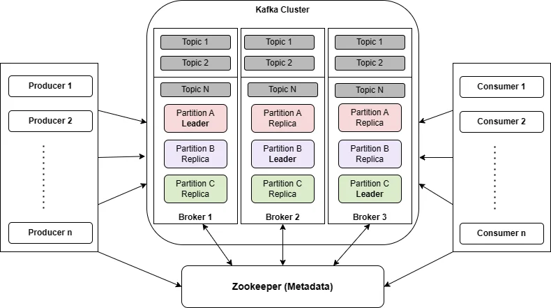

# Kafka : 

## Defintion
Apache Kafka is an open-source distributed event streaming platform used by thousands of companies for high-performance data pipelines, streaming analytics, data integration, and mission-critical applications.

## Components
1. Events : 

    - 1 event record something happened in the platform . It is also called record or message in documentation . Conceptually, an event has a key, value, timestamp, and optional metadata headers

2. Topics
    - Events are organized and durably stored in topics. Very simplified, a topic is similar to a folder in a filesystem, and the events are the files in that folder. An example topic name could be "payments". Topics in Kafka are always multi-producer and multi-subscriber: a topic can have zero, one, or many producers that write events to it, as well as zero, one, or many consumers that subscribe to these events. Events in a topic can be read as often as needed—unlike traditional messaging systems, events are not deleted after consumption

3. Broker
    - A Kafka server that rún in Kafka cluster . Multiple Kafka brokers form a cluster .Brokers handle all read and write requests from Kafka producers and consumers and ensure data replication and fault tolerance to prevent data loss.

4. Cluster
    - A group of Kafka brokers

5. Partition and Replication
    - Topics are partitioned, meaning a topic is spread over a number of "buckets" located on different Kafka brokers
    - To make your data fault-tolerant and highly-available, every topic can be replicated, even across geo-regions or datacenters, so that there are always multiple brokers that have a copy of the data just in case things go wrong, you want to do maintenance on the brokers.

6. Producer
    - Are those client applications that publish (write) events to Kafka

7. Consumer
    - Those that subscribe to (read and process) these events

## Architecture
This is the architecture of Kafka 




## Zookeeper 
- In a Kafka ZooKeeper cluster, ZooKeeper plays a crucial role in coordinating and managing the distributed environment.

- It serves as a centralized spot for maintaining and storing the metadata for Kafka, which includes details on topics, partitions, consumer offsets, and cluster setup. ZooKeeper maintains a consistent picture of the cluster across all participating Kafka brokers, ensuring data consistency and fault tolerance. In a Kafka cluster, ZooKeeper ensures fault tolerance by keeping consistent metadata across brokers.

## Role in this project 
- In this project , Kafka is a message queue to receive log data from platform then from Kafka topic , the system will insert in the datalake . In real project, the log data from online platform may be huge due to the number of users in 1 time so if we insert directly log data in Datalake may cause Datalake overload 

# Set up the kafka on Docker 

## Prerequisites
You should install Docker and Docker Compose 

### 1. Create a `docker-compose.yml` file for kafka including two services : zookeeper and kafka
```yaml
version: "3"
networks:
  myNetwork:

services:
  zookeeper:
    image: 'bitnami/zookeeper:latest'
    ports:
      - '2181:2181'
    environment:
      - ALLOW_ANONYMOUS_LOGIN=yes
    networks:
      - my-network

  kafka:
    image: 'bitnami/kafka:latest'
    user: root
    ports:
      - '9092:9092'
    environment:
      - KAFKA_BROKER_ID=1
      - KAFKA_LISTENERS=PLAINTEXT://:9092
      - KAFKA_ADVERTISED_LISTENERS=PLAINTEXT://127.0.0.1:9092
      - KAFKA_ZOOKEEPER_CONNECT=zookeeper:2181
      - ALLOW_PLAINTEXT_LISTENER=yes
    volumes:
      - ./Kafka:/bitnami/kafka
    networks:
      - my-network
    depends_on:
      - zookeeper


```
## Build the docker container : 
```
docker-compose up -d 
```
## Access Kafka : 
1. Open shell in the Kafka container
```
docker exec -it kafka-1 /bin/bash
```

2. Create a topic 
```
kafka-topics.sh --create --topic log-data --bootstrap-server localhost:9092 --replication-factor 1 --partitions 1
```
3. Run 2 files `faking_data.py` and `receive_faking_data.py` to simulate the data from online platform come to thee datalake


# Reference

- [Apache Kafka Documentation](https://kafka.apache.org/documentation/#introduction)
- [How to set up Kafka (1)](https://www.startdataengineering.com/post/what-why-and-how-apache-kafka/)
- [How to set up Kafka (2)](https://www.digitalocean.com/community/developer-center/how-to-deploy-kafka-on-docker-and-digitalocean-kubernetes)
- [Image for Kafka Architecture](https://200lab.io/blog/kafka-la-gi/)